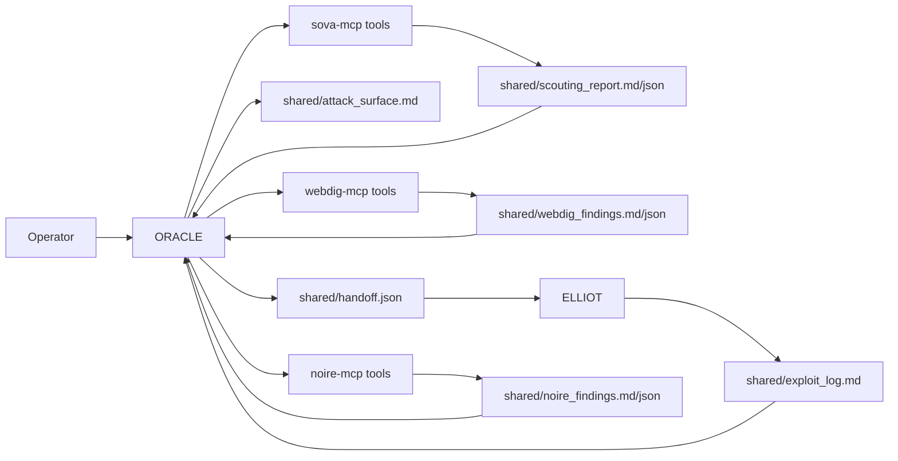
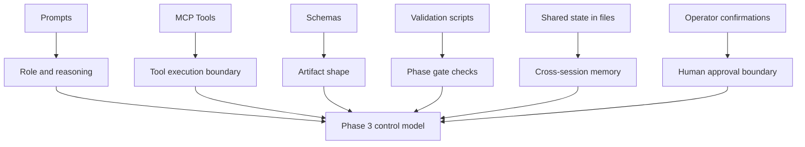
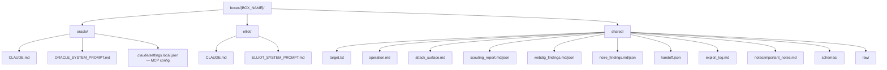
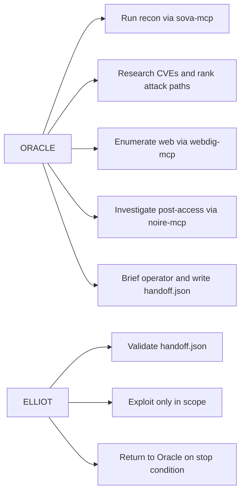
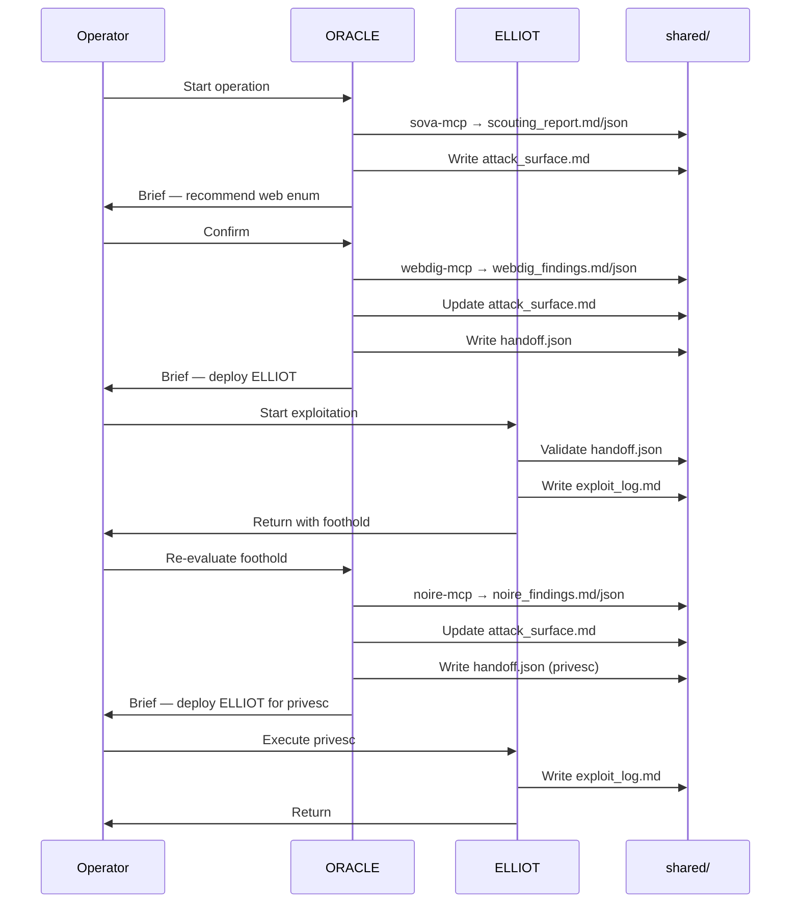
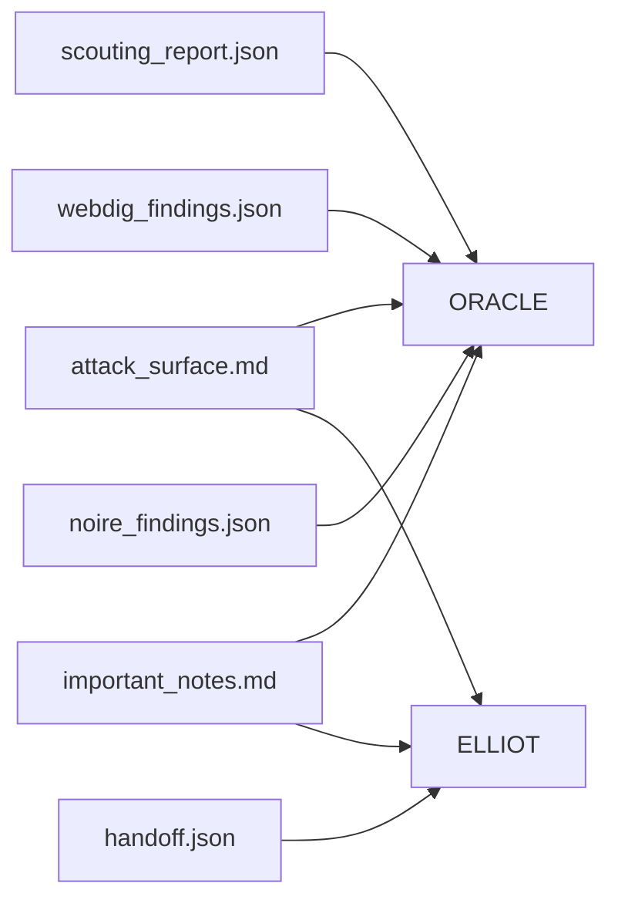
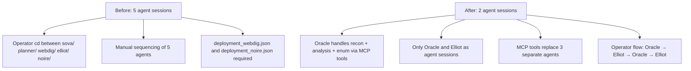
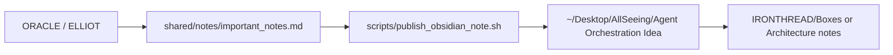

# Infra Wireframe
> Current Phase 3 architecture for `IRONTHREAD`

---

## 1. High-Level Flow

---

## 2. Current Control Plane

---

## 3. Box-Level Directory Wireframe

---

## 4. Agent Responsibilities

---

## 5. Execution Thread

---

## 6. Artifact Dependency Map

---

## 7. MCP Tool Servers

```mermaid
flowchart TD
    A["ORACLE"] --> B["sova-mcp"]
    A --> C["webdig-mcp"]
    A --> D["noire-mcp"]

    B --> B1["sova_full_scan"]
    B --> B2["sova_whatweb"]
    B --> B3["sova_banner_grab"]
    B --> B4["sova_zone_transfer"]
    B --> B5["sova_null_session"]
    B --> B6["sova_anon_ftp"]

    C --> C1["webdig_dir_bust"]
    C --> C2["webdig_vhost_fuzz"]
    C --> C3["webdig_whatweb"]
    C --> C4["webdig_curl"]
    C --> C5["webdig_js_review"]

    D --> D1["noire_system_profile"]
    D --> D2["noire_sudo_check"]
    D --> D3["noire_suid_scan"]
    D --> D4["noire_cron_inspect"]
    D --> D5["noire_service_enum"]
    D --> D6["noire_config_harvest"]
    D --> D7["noire_writable_paths"]
```

---

## 8. What Changed In Phase 3

---

## 9. Obsidian Note Flow

---

## 10. Short Explainer

The current infrastructure is a two-agent system with MCP tool servers.

- `ORACLE` runs recon (sova-mcp), analyzes and researches CVEs, enumerates web surface (webdig-mcp), investigates post-access (noire-mcp), briefs the operator, and writes scoped handoff.json.
- `ELLIOT` exploits only after scoped authorization via handoff.json.
- `shared/` is the system bus — all intelligence flows through files.
- `schemas/` define artifact contracts.
- MCP servers wrap CLI tools (nmap, gobuster, ffuf, etc.) as structured tool calls.
