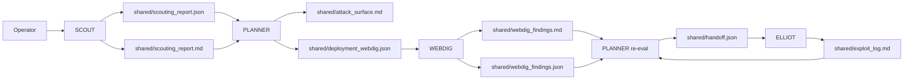
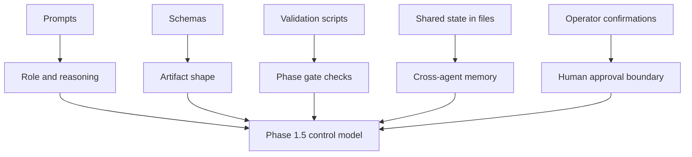
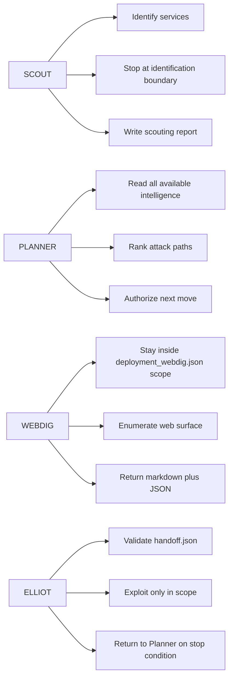
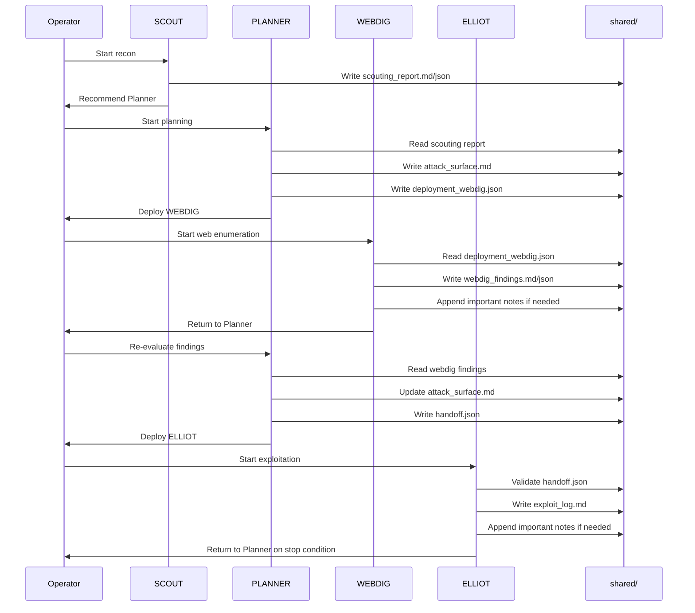
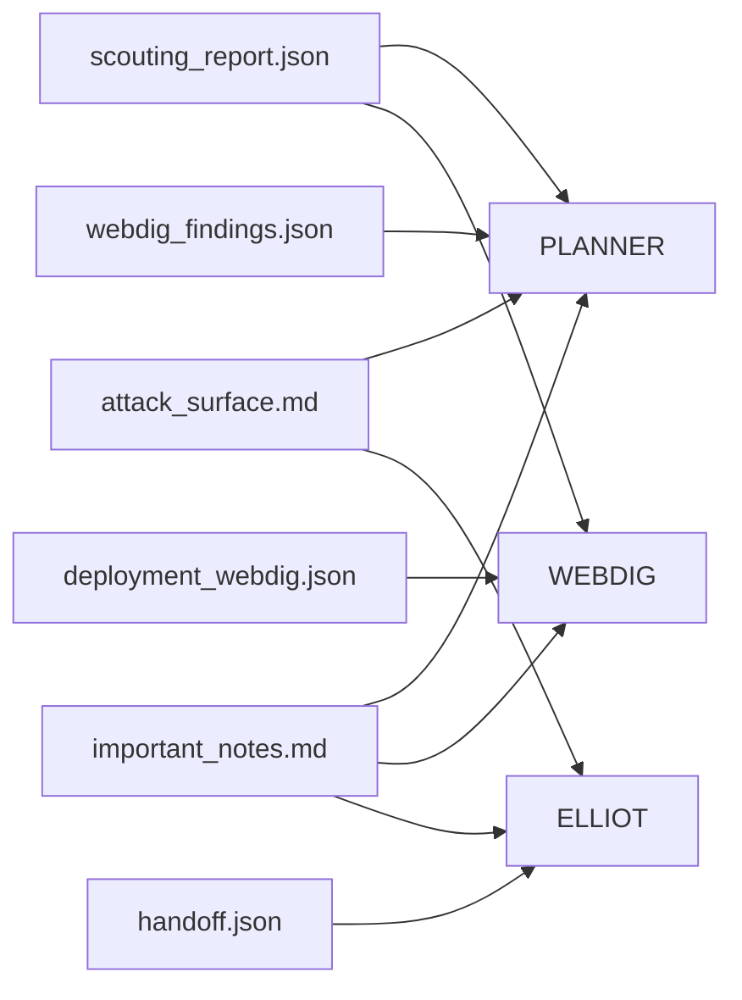
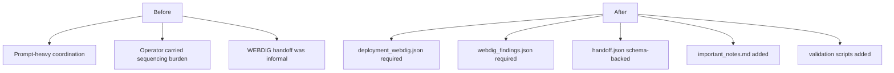
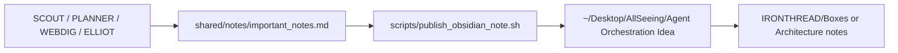

# Infra Wireframe
> Current Phase 1.5 architecture for `IRONTHREAD`

---

## 1. High-Level Flow

---

## 2. Current Control Plane

---

## 3. Box-Level Directory Wireframe

```mermaid
flowchart TD
    A["boxes/{BOX_NAME}/"] --> B["scout/"]
    A --> C["planner/"]
    A --> D["webdig/"]
    A --> E["elliot/"]
    A --> F["shared/"]

    B --> B1["CLAUDE.md"]
    B --> B2["SCOUT_SYSTEM_PROMPT.md"]
    B --> B3["SCOUT_REPORT_TEMPLATE.md"]
    B --> B4["SCOUT_REPORT_SCHEMA.json"]

    C --> C1["CLAUDE.md"]
    C --> C2["PLANNER_SYSTEM_PROMPT.md"]

    D --> D1["CLAUDE.md"]
    D --> D2["WEBDIG_SYSTEM_PROMPT.md"]

    E --> E1["CLAUDE.md"]
    E --> E2["ELLIOT_SYSTEM_PROMPT.md"]

    F --> F1["target.txt"]
    F --> F2["operation.md"]
    F --> F3["attack_surface.md"]
    F --> F4["scouting_report.md"]
    F --> F5["scouting_report.json"]
    F --> F6["deployment_webdig.json"]
    F --> F7["webdig_findings.md"]
    F --> F8["webdig_findings.json"]
    F --> F9["handoff.json"]
    F --> F10["exploit_log.md"]
    F --> F11["notes/important_notes.md"]
    F --> F12["schemas/"]
    F --> F13["raw/"]
```

---

## 4. Agent Responsibilities

---

## 5. Web-First Execution Thread

---

## 6. Artifact Dependency Map

---

## 7. What Changed In Phase 1.5

---

## 8. Obsidian Note Flow

---

## 9. Short Explainer

The current infrastructure is a file-backed multi-agent workflow.

- `SCOUT` discovers and identifies.
- `PLANNER` decides and authorizes.
- `WEBDIG` enumerates web scope under a bounded deployment contract.
- `ELLIOT` exploits only after scoped authorization.
- `shared/` is the system bus.
- `schemas/` and validation scripts are the first step away from prompt-only control.
